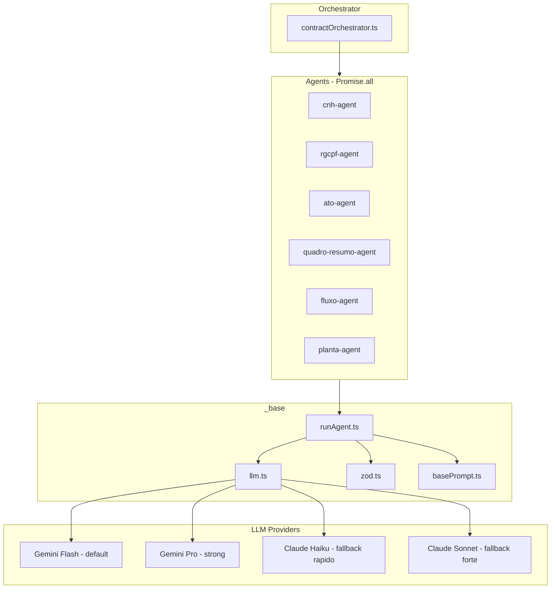
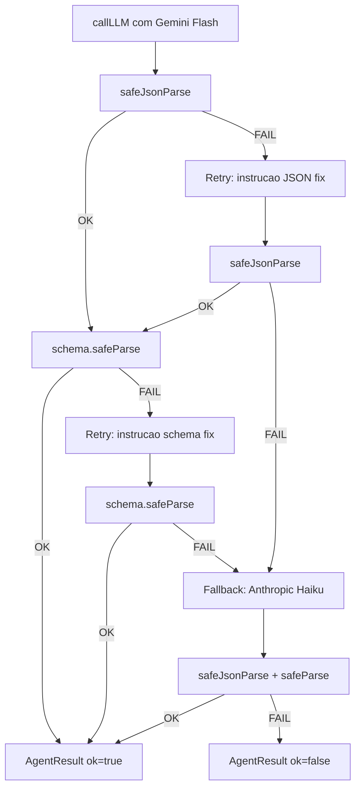

# Multi-Agent AI para Validação de Contratos

## Contexto

O projeto já possui:

- Schema de banco com `reservation_audits` (score, resultJson, aiRawOutput, executionTimeMs) e `audit_logs` (level, message, metadata) em [src/db/schema.ts](src/db/schema.ts)
- Pipeline de processamento de reservas em [src/services/reservation.service.ts](src/services/reservation.service.ts) que salva `cvcrmSnapshot` com status `pending`
- **Nenhuma** dependência AI instalada (`ai`, `@ai-sdk/google`, `@ai-sdk/anthropic`, `zod` ausentes)
- **Nenhum** diretório `src/ai/`

## Dependências a instalar

```bash
npm install ai @ai-sdk/google @ai-sdk/anthropic zod
```

## Variáveis de ambiente

Adicionar ao `.env` e `.env.local.example`:

- `GOOGLE_GENERATIVE_AI_API_KEY`
- `ANTHROPIC_API_KEY`

## Arquitetura




## Fluxo de Retry/Fallback




## Model Map Central

Definido em `src/ai/_base/llm.ts`:

- `google_flash` = `gemini-2.0-flash` -- default para todos os agentes (rapido/barato)
- `google_pro` = `gemini-2.0-pro` -- disponivel para override quando necessario
- `anthropic_haiku` = `claude-3-5-haiku-latest` -- fallback rapido (parse dificil)
- `anthropic_sonnet` = `claude-3-5-sonnet-latest` -- fallback forte (documentos complexos)

Estrategia de selecao:

- Primary: `google_flash` (custo baixo, velocidade)
- Fallback automatico: `anthropic_haiku` (quando parse/validacao falha)
- Override via `options.model`: permite usar `google_pro` ou `anthropic_sonnet` para casos especificos

## Estrutura de Arquivos

```
src/ai/
  _base/
    basePrompt.ts    -- Prompt base com regras de normalizacao
    types.ts         -- Provider, AgentName, AgentInput, AgentResult, ModelKey
    llm.ts           -- Model map + callLLM (Vercel AI SDK generateText)
    zod.ts           -- safeJsonParse helper
    runAgent.ts      -- Runner com retry + fallback
  agents/
    cnh-agent/
      schema.ts      -- Zod schema CNH
      prompt.ts      -- Prompt especifico
      agent.ts       -- runCnhAgent()
    rgcpf-agent/
      schema.ts / prompt.ts / agent.ts
    ato-agent/
      schema.ts / prompt.ts / agent.ts
    quadro-resumo-agent/
      schema.ts / prompt.ts / agent.ts
    fluxo-agent/
      schema.ts / prompt.ts / agent.ts
    planta-agent/
      schema.ts / prompt.ts / agent.ts
  orchestrator/
    contractOrchestrator.ts  -- analyzeContract() com Promise.all
  index.ts                   -- Re-exports
```

## Implementacao por Arquivo

### 1. `_base/basePrompt.ts`

- String constante com regras globais: JSON puro, sem markdown, normalizacao (datas YYYY-MM-DD, valores numericos com ponto, CPF 11 digitos, CNPJ 14), nao alucinar

### 2. `_base/types.ts`

- `Provider = "google" | "anthropic"`
- `ModelKey = "google_flash" | "google_pro" | "anthropic_haiku" | "anthropic_sonnet"`
- `AgentName` = union dos 6 agentes
- `AgentInput = { text: string; documentId?: string; metadata?: Record<string, unknown> }`
- `AgentRunOptions = { provider?: Provider; modelKey?: ModelKey; temperature?: number; maxTokens?: number }`
- `AgentResult<T> = { agent: AgentName; ok: boolean; data?: T; error?: string; raw?: string; provider?: Provider; model?: string; attempts: number }`

### 3. `_base/llm.ts`

- Import `generateText` from `ai`, `google` from `@ai-sdk/google`, `anthropic` from `@ai-sdk/anthropic`
- `MODEL_MAP` objeto com 4 entries mapeando `ModelKey` para instancia do provider
- `DEFAULT_MODELS: Record<Provider, ModelKey>` = `{ google: "google_flash", anthropic: "anthropic_haiku" }`
- `FALLBACK_MODELS: Record<Provider, ModelKey>` = `{ google: "anthropic_haiku", anthropic: "google_flash" }`
- `callLLM()` usa `generateText` com `model: MODEL_MAP[modelKey]`

### 4. `_base/zod.ts`

- `safeJsonParse(raw)`: trim, tenta `JSON.parse`, se falha extrai primeiro `{...}` via regex e tenta novamente

### 5. `_base/runAgent.ts`

- Logica: attempt 1 (primary) -> parse fail? retry com instrucao -> schema fail? retry com instrucao -> tudo falhou? fallback provider (1 tentativa) -> retorna `AgentResult`
- Contador de `attempts`, preserva `raw` para debug

### 6. Cada Agent (mesmo padrao)

- `schema.ts`: Zod object com `.strict()`, export do schema e do tipo inferido
- `prompt.ts`: concatena `basePrompt` + tipo de documento + schema JSON stringified + regras especificas
- `agent.ts`: funcao `runXAgent(input, options?)` que chama `runAgent` com schema + prompt do agente

### 7. `orchestrator/contractOrchestrator.ts`

- `analyzeContract(input, agents?, options?)`: executa agentes selecionados via `Promise.all`
- Retorna `{ ok, results, summary: { failed_agents, totals } }`
- `ok = true` se pelo menos 1 agente retornou ok

### 8. `index.ts`

- Re-exporta `analyzeContract`, cada `runXAgent`, e tipos principais

